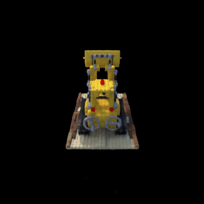
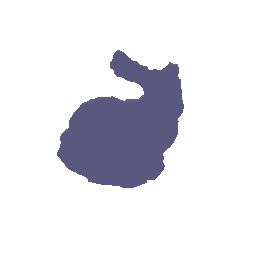
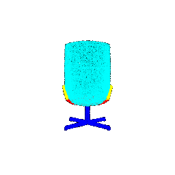

<!-- ---
title: 16-889 Learning for 3D Vision
summary: The archive for project and assiganments for course 16-889 Learning for 3D Vision
tags:
  - Learning for 3D Vision
date: '2022-05-06T00:00:00Z'

# Optional external URL for project (replaces project detail page).
external_link: ''

image:
  caption: 
  focal_point: Smart

links:
  - icon: ""
    icon_pack: fab
    name: Course Webstie
    url: https://learning3d.github.io/pages/schedule.html
  - icon: ""
    icon_pack: fab
    name: Assignment 1
    url: https://www.andrew.cmu.edu/course/16-889/projects/yutianle/proj1/
  - icon: ""
    icon_pack: fab
    name: Assignment 2
    url: https://www.andrew.cmu.edu/course/16-889/projects/yutianle/proj2/
  - icon: ""
    icon_pack: fab
    name: Assignment 3
    url: https://www.andrew.cmu.edu/course/16-889/projects/yutianle/proj3/
  - icon: ""
    icon_pack: fab
    name: Assignment 4
    url: https://www.andrew.cmu.edu/course/16-889/projects/yutianle/proj4/
  - icon: ""
    icon_pack: fab
    name: Assignment 5
    url: https://www.andrew.cmu.edu/course/16-889/projects/yutianle/proj5/
  # - icon: ""
  #   icon_pack: fab
  #   name: Course Project
  #   url: https://www.andrew.cmu.edu/course/16-889/projects/yutianle/project/
url_code: ''
url_pdf: ''
url_slides: ''
url_video: ''

# Slides (optional).
#   Associate this project with Markdown slides.
#   Simply enter your slide deck's filename without extension.
#   E.g. `slides = "example-slides"` references `content/slides/example-slides.md`.
#   Otherwise, set `slides = ""`.
---
### [Assignment 1: Rendering basics with Pytorch3D](https://www.andrew.cmu.edu/course/16-889/projects/yutianle/proj1/)

 In this assignment, the basics of 3D representations and rendering with PyTorch3D are learned and explored. 

### [Assignment 2: Single View to 3D](https://www.andrew.cmu.edu/course/16-889/projects/yutianle/proj2/)

In this assignment, I explored multiple types of loss and decoder functions for regressing to voxels, point clouds, and mesh representations from single view RGB input.

### [Assignment 3: Volume Rendering and Neural Radiance Fields](https://www.andrew.cmu.edu/course/16-889/projects/yutianle/proj3/)

In this assignment, the NeRF model is implemented step by step. In the first section, differentiable renderer for emission-absorption (EA) volumes is implemented, which is used to optimize scene parameters in later section. In the second section, we tried to optimize the parameters of a square volume using the differentiable volume renderer and a given Signed Distance Fields (SDF) as implicit function. In the third section, the navie Neural Radiance Field (NerF) is implemented, and used to as a implicit volume to optimize a scene from a set of RGB images. Finally, in the last section, View Dependence, Hierarchical Sampling and High Resolution Imagery is implemented to improve the performance and accuracy of the navie NeRF.

### [Assignment 4: Neural Surfaces](https://www.andrew.cmu.edu/course/16-889/projects/yutianle/proj4/)

In this assignent, I implement sphere tracing for rendering an SDF and implement an MLP architecture for a neural SDF, and train this neural SDF on point cloud data. Finally, I implement a function converting SDF to volume density and color, and train an SDF on the lego bulldozer model.

### [Assignment 5: Point Cloud Classification and Segmentation](https://www.andrew.cmu.edu/course/16-889/projects/yutianle/proj5/)

In this assignment, a PointNet based architecture for classification and segmentation with point clouds is implemented.

<!-- ### [Course Project: 3D-Aware Human Texture Synthesis](https://www.andrew.cmu.edu/course/16-889/projects/yutianle/project/)

In this project, we aim to design a generative model that is able to generate full textures of full human bodies and renders photorealistic images with given a variety of poses and camera angles. -->