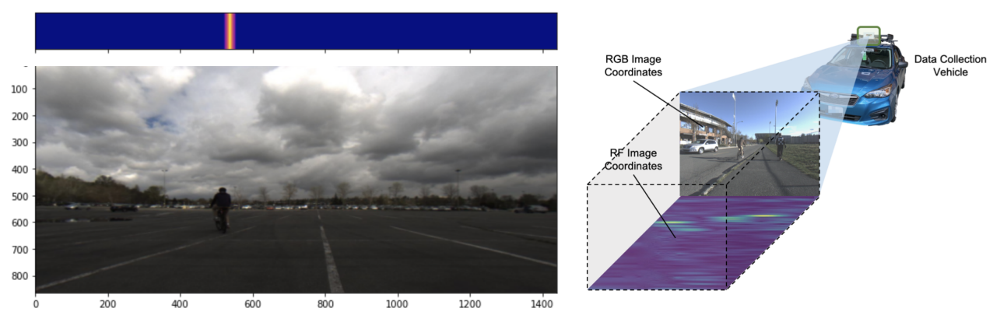
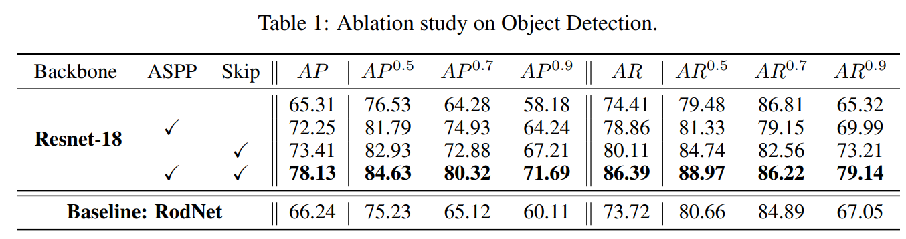
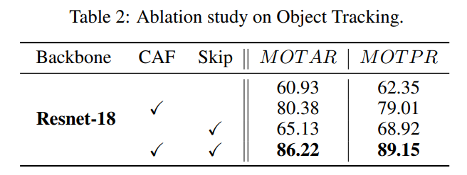
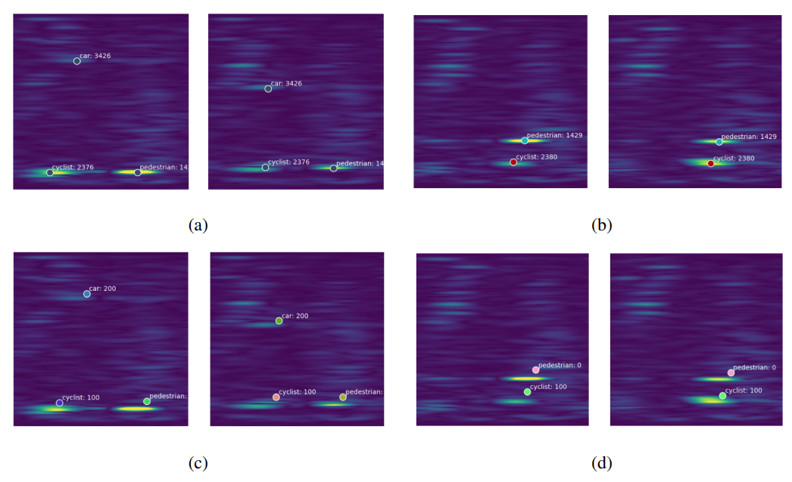

## Introduction
Object detection and tracking play a crucial role in ensuring the safety of autonomous driving systems. Traditionally, this task has been performed using cameras and LiDAR (Light Detection and Ranging) technologies. However, these methods have some inherent drawbacks. Both are sensitive to lighting and weather conditions, which may impede their performance under adverse conditions. In addition, LiDAR technology tends to be expensive, making it a less practical solution for commercial autonomous vehicles.

To address these challenges, we turn our attention to radar technology. Radars are robust, capable of performing well under various weather conditions, and are relatively inexpensive compared to LiDAR systems. In this project, we developed an end-to-end network model to detect and track objects using frequency-modulated continuous-wave (FMCW) radar data.

## Dataset
The lack of a public radar tracking dataset made our task slightly more challenging. To overcome this, we labeled the CRUW dataset - a public camera-radar dataset for autonomous driving. The dataset consists of around 3.5 hours of camera-radar data collected from diverse environments such as parking lots, campus roads, city streets, and highways. The sensors used to collect the data include a pair of stereo cameras and two 77GHz FMCW radar antenna arrays.

To annotate the dataset for tracking, we developed a semi-automatic annotation method. We first generated image-based object detection results using Mask-RCNN, which were then fed into the SORT tracking algorithm. By projecting the tracked objects to the radar field, we were able to label raw radar data with object categories and tracking ids.

## Model
Our model for radar detection and tracking consists of six main components:

<ol>
<li> <strong> 2D-CNN Encoder Backbone </strong>: We use a ResNet-18 architecture to extract detection features from a key radar frame. These detection features provide spatial information that is essential for detecting objects. </li>

<li> <strong> 3D-CNN Encoder Backbone </strong>: We use a 3DResNet-18 architecture to extract tracking features from a radar clip. These features provide spatial-temporal information that is crucial for tracking objects. </li>

<li> <strong> Channel Fusion and Attention (CFA) Module </strong>: This module aggregates features from both the 2D and 3D encoders, smoothly combining the features from both spatial and spatial-temporal information. </li>

<li> <strong> Atrous Spatial Pyramid Pooling (ASPP) Module </strong>: This module captures multi-scale information by probing the input feature with multiple filters that have complementary fields of view. </li>

<li> <strong> Decoder Modules </strong>: These modules take the output features from the ASPP and CFA modules and refine them to generate the final detection and tracking results. </li>

</ol>

Task-specific prediction heads: These prediction heads produce the final object detection and tracking outputs.

By combining these components, our model can accurately detect and track multiple objects in radar data, enhancing the perception capabilities of autonomous driving systems.

## 6. Experiments and Results

In this section, we will present the results of our experiments and analyze the performance of our model for both detection and tracking tasks. We will discuss the baseline performance, the quantitative results of our ablation study, and the qualitative results.

### 6.1 Baseline Performance

We chose the RODNet as our baseline model for radar object detection. However, since the dataset used in the original paper was different from the CRUW dataset used in this project, we implemented and trained the baseline model on our dataset to make the results comparable. The quantitative detection results of the baseline model trained on CRUW dataset are shown in Table 1.

### 6.2 Quantitative Performance of Detection

We conducted an ablation study on different modules of our model for object detection. The results are shown in Table 1, where we compared our model's average precision (AP) and average recall (AR) with different configurations.

### 6.3 Quantitative Performance of Tracking

Similarly, we performed an ablation study on different modules of our model for object tracking. The results are shown in Table 2, where we compared our model's multiple object tracking average recall (MOTAR) and multiple object tracking precision and recall (MOTPR) with different configurations.

### 6.4 Qualitative Results

We have visualized our results, including detection and tracking labels, and compared them with the ground truth. The figure above shows some examples of our detection and tracking results.

## 7. Conclusion and Discussion

In this project, we proposed a combined multiple object detection and tracking network for FMCW radar data. We achieved better detection performance compared to the baseline model through our ablation study. We also demonstrated the effectiveness of different modules in our model. Our tracking results were satisfactory both qualitatively and quantitatively.

## 8. Future Work

In the future, we plan to focus on the following areas:

<ul>
<li> <strong> Improving efficiency </strong>: We aim to make our model real-time capable and optimize the post-processing time, especially as the number of objects increases. </li>

<li> <strong> Multi-modal system </strong>: We plan to incorporate other sensor data, such as vision or LiDAR, to further enhance the robustness of the system through multi-sensor fusion.

<li> <strong> Comparison with traditional methods </strong>: We will conduct comparisons with other traditional radar object detection methods to evaluate the performance of our model.

<li> <strong> Further ablation studies </strong>: We will experiment with different 2D-CNN backbones in our ablation study to gain more comprehensive insights into the best network configurations.

</ul>