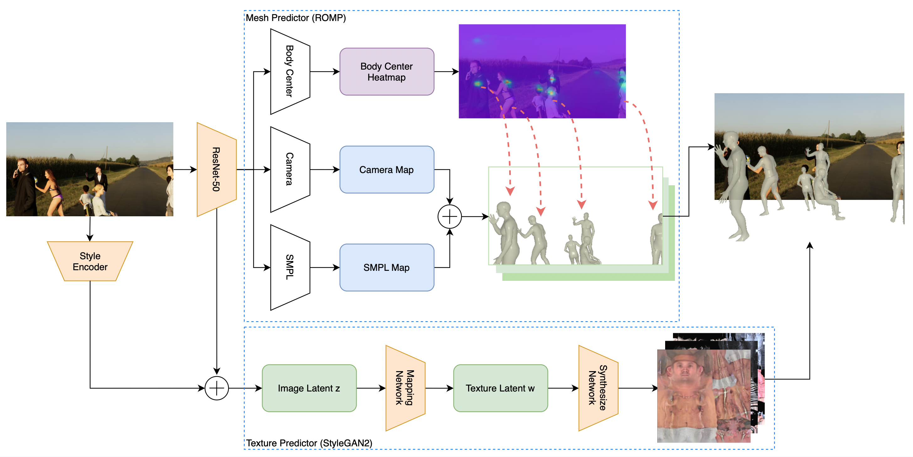
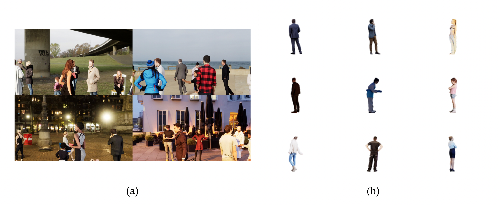
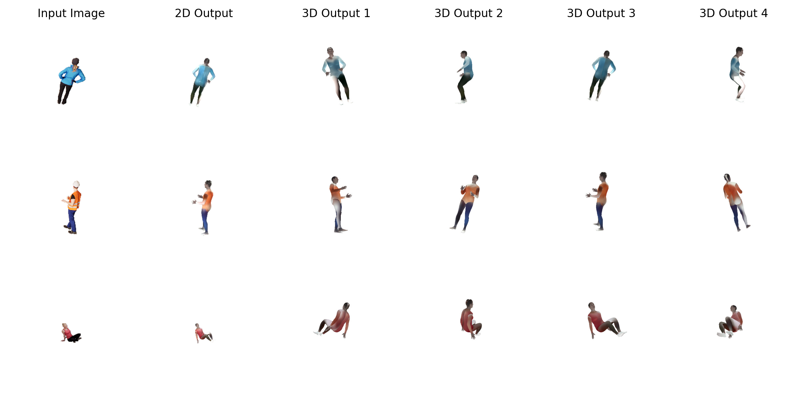

## Introduction
In this project a deep learning model that innovatively bridges the gap between 2D images and 3D structures is presented. Leveraging the potency of StyleGAN2 and other advanced techniques, this model can predict human body meshes and textures from a given image. The most exciting part? It does not require ground truth textures, making data collection less cumbersome and more cost-effective.

## Method

#### Overview
We propose a two-predictor model for multi-person 3D mesh reconstruction from input images. It comprises a Mesh Predictor, based on the ROMP network, and a Texture Predictor, built upon StyleGAN2.

#### 3D Human Mesh Predictor
Our Mesh Predictor uses a multi-head design. It processes a single RGB image and outputs maps describing the estimated 3D human meshes:

<ul>
<li> <strong>Body Center heatmap</strong> : Represents the probability of each position being a human body center, accommodating for different scales.</li>
<li> <strong>Camera map</strong>: Predicts the camera parameters pixel-wise, including 2D scale and translation.</li>
<li> <strong>SMPL map</strong>: Provides the SMPL parameters pixel-wise, detailing the 3D pose and shape of the body mesh.</li>

</ul>
Post prediction, these maps are sampled, matched with ground truth body center, and input into the SMPL model to generate the 3D body meshes.

#### Texture Predictor
The Texture Predictor leverages StyleGAN2, using a trained ResNet-18 as a style encoder to extract latent style information from input images. This information is then incorporated with 3D structure information to generate a latent code. Subsequently, a mapping network transforms the latent code into a style code. The Synthesize Network then controls the generation at different resolutions. The renderer finally takes the full texture and the generated body mesh to render an output image.

#### Loss Function
To supervise the predictors, we developed individual loss functions:
<ul>
<li> <strong>3D Mesh Loss</strong>: Encourages a high confidence value at the body center and low confidence elsewhere. It also takes into account the accuracy of predicted SMPL and camera parameters, as well as the 2D joint projections. </li>
<li> <strong>Texture Loss </strong>: Considers perceptual loss (high-level similarity of generated and ground truth images), reconstruction loss (photo-realism), and Kullback–Leibler divergence loss (approximation of learned latent texture distribution to a standard normal distribution). </li>
</ul>
The total loss will be a combination of these individual losses.

## Experiments
Due to limited computational resources, we trained our model to generate 64x64 texture images using a GeForce RTX 2080 GPU. The model was trained using an ADAM optimizer with a batch size of 16 and a learning rate of 0.0001 for 40,000 iterations. The learning rate was decayed by a factor of 10 at 20,000 and 25,000 iterations.

#### Dataset
We utilized the Avatars in Geography Optimized for Regression Analysis (AGORA) dataset, which offers high-realism synthetic human data with accurate ground truths. The dataset comprises around 14K training and 3K test images, rendering between 5 to 15 people per image. To simplify, each training image only contains one person against a white background.

#### Qualitative Results
Our predicted textures preserved the general color of the input image, and the new synthetic views were plausible, though they lacked in detail and sharpness. Three potential reasons were identified for these limitations:

Limited computational resources restricting the generation of texture images to 64x64.
Utilization of StyleGAN2 only as a generator without any adversarial loss.
The potential to improve by pre-training the GAN on an SMPL texture dataset.
To confirm the third point, we trained the GAN on the SURREAL dataset, which resulted in significantly more detailed textures.

#### Quantitative Results
We used three metrics: Structural Similarity Index Measure (SSIM), Peak signal-to-noise ratio (PSNR), and Fréchet Inception Distance (FID) to evaluate our results.

SSIM evaluates perceived change in structural information and perceptual phenomena.
PSNR quantifies image reconstruction quality.
FID measures the distance between the distribution of the synthetic and real-world image feature space.
Our SSIM results were high, suggesting a similar distribution between the generated and ground truth images. PSNR and FID values were within a reasonable range, confirming our qualitative results.
| Metric | Value |
|--------|-------|
| SSIM   | 0.974 |
| PSNR   | 26.134|
| FID    | 36.144|

## Conclusion
Our deep learning model efficiently predicts human mesh and texture without needing ground truth texture. This makes data collection easier and cost-effective. Although our model provides more realistic rendering than previous methods, further enhancements can be made. In the future, we plan to improve facial texture generation, introduce adversarial loss for better results, and consider pretraining StyleGAN2 on an SMPL texture dataset for improved texture prediction.