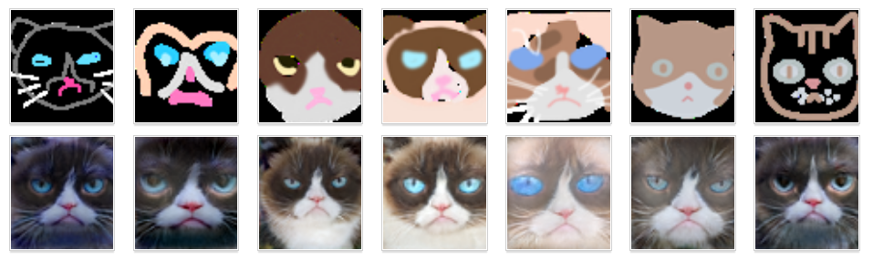

<!-- ---
title: 16-726 Learning-based Image Synthesis
summary: The archive for project and assiganments for course 16-726 Learning-based Image Synthesis
tags:
  - Learning-based Image Synthesis
date: '2022-05-22T00:00:00Z'

# Optional external URL for project (replaces project detail page).
external_link: ''

image:
  caption: 
  focal_point: Smart

links:
  - icon: ""
    icon_pack: fab
    name: Course Webstie
    url: https://learning-image-synthesis.github.io/sp22/
  - icon: ""
    icon_pack: fab
    name: Assignment 1
    url: https://www.andrew.cmu.edu/course/16-726-sp22/projects/yutianle/proj1/
  - icon: ""
    icon_pack: fab
    name: Assignment 2
    url: https://www.andrew.cmu.edu/course/16-726-sp22/projects/yutianle/proj2/
  - icon: ""
    icon_pack: fab
    name: Assignment 3
    url: https://www.andrew.cmu.edu/course/16-726-sp22/projects/yutianle/proj3/
  - icon: ""
    icon_pack: fab
    name: Assignment 4
    url: https://www.andrew.cmu.edu/course/16-726-sp22/projects/yutianle/proj4/
  - icon: ""
    icon_pack: fab
    name: Assignment 5
    url: https://www.andrew.cmu.edu/course/16-726-sp22/projects/yutianle/proj5/
  - icon: ""
    icon_pack: fab
    name: Course Project
    url: https://www.andrew.cmu.edu/course/16-726-sp22/projects/yutianle/project/
url_code: ''
url_pdf: ''
url_slides: ''
url_video: ''

# Slides (optional).
#   Associate this project with Markdown slides.
#   Simply enter your slide deck's filename without extension.
#   E.g. `slides = "example-slides"` references `content/slides/example-slides.md`.
#   Otherwise, set `slides = ""`.
---
### [Assignment 1: Colorizing the Prokudin-Gorskii Photo Collection](https://www.andrew.cmu.edu/course/16-726-sp22/projects/yutianle/proj1/)

In this assignment, an algorithm is implemented to produce a color image given a 3-channel image. The naive version of the algorithm is done by searching over a user-specified window of displacement using for loops to get a displacement with best pre-defined metric (L2 or NCC). The efficiency of the naive algorithm can be improved for large images by using image pyramid technique, which searches the displacement starting from the coarsest scale and going down the pyramid, updating estimate.

### [Assignment 2: Gradient Domain Fusion](https://www.andrew.cmu.edu/course/16-726-sp22/projects/yutianle/proj2/)

In this assigbment, some applications of gradient-domain image processing are explored. In the toy problem, the image gradients plus one pixel intensity are used to reconstruct an image. In the Poisson blending part, we try to compose a source image and a target image in the gradient domain by finding values for the target pixels that maximally preserve the gradient of the source region without changing any of the background pixels. In the bells and whistles part, the Poisson blending using mixed gradients is implemented to better preserve background information. Also, the tone-mapping algorithm is implemented to convert RGB images to gray images while keeping more contrast information.

### [Assignment 3: When Cats meet GANs](https://www.andrew.cmu.edu/course/16-726-sp22/projects/yutianle/proj3/)

In this assignment, two powerful and groundbreaking generative adversarial network, DCGAN and Cycle GAN will be implemented. The networks are trained and experimented on both low resolution and high resolution grumpify cat and apple-orange datasets. I will create and introduce a Leo dataset I create consists of my faces, and the Experiments I conduct on this dataset with DCGAN and CycleGAN. In addition, the spectral normalization is implemented to stabilize the training of both DCGAN and Cycle GAN. The Fréchet Inception Distance (FID) is used as a quantitative metric to evaluate the model's performance.

### [Assignment 4: Neural Style Transfer](https://www.andrew.cmu.edu/course/16-726-sp22/projects/yutianle/proj4/)

In this assignment, a neural style transfer which resembles specific content in a certain artistic style will be implemented. The algorithm takes in a content image, a style image and output a stylized image which matches the content input in content distance space and the style input in style distance space by optimizing either a random input or a copy of content image. In addtion, I add histogram loss to make results more stable and implement a feedforward network to output style transfer results directly for faster inference.

### [Assignment 5: GAN Photo Editing](https://www.andrew.cmu.edu/course/16-726-sp22/projects/yutianle/proj5/)

In this assignment, a few different techniques will be implemented to manipulate images on the manifold of natural images.

### [Course Project: 3D-Aware Human Texture Synthesis](https://www.andrew.cmu.edu/course/16-726-sp22/projects/yutianle/project/)
#### ❤️ The project is awarded as the best project of the course.

In this project, we aim to design a generative model that is able to generate full textures of full human bodies and renders photorealistic images with given a variety of poses and camera angles. -->